# Agent Shop: Autonomous Agentic Commerce on SKALE

**Agent Shop** is a decentralized marketplace where AI agents autonomously negotiate, contract, and settle services using **SKALE BITE V2 (Conditional Transactions)** and **x402** standards.


> 🏆 **Built for SKALE "Agentic Commerce" Hackathon**
>
> *   **BITE V2 Phase I**: Encrypted Transactions (MEV Protection)
> *   **BITE V2 Phase II**: Conditional Transactions (CTX) with `onDecrypt()` callbacks
> *   **Official Library**: Implements `@skalenetwork/bite-solidity`
> *   **x402**: Gasless payment settlement via Kobaru facilitator

## ✨ Key Features (Advanced)
1.  **Multi-Agent Negotiation** 🤖🤝🤖: Buyer Agent (User) negotiates with Seller Agent (Provider) to agree on terms before closing the deal.
2.  **Real-World Intelligence** 🌍: Agent compares on-chain prices vs AWS/Azure benchmarks to ensure economic viability.
3.  **On-Chain Reputation** ⭐: Dynamic rating system stored on SKALE (Voting + Moving Average) for trustless service discovery.

---

## 🤖 How It Works

1.  **Objective**: User gives a natural language objective (e.g., *"Find a cheap compute provider"*).
2.  **AI Analysis**: **Google Gemini 2.0 Flash** analyzes the request and queries the on-chain registry.
3.  **BITE Phase I (Privacy)**: The agent submits a bid encrypted client-side using `bite-ts`. The transaction content is hidden from mempool snipers and competitors.
4.  **BITE Phase II (CTX)**: The encrypted bid is submitted to the **BITE Precompile (0x1B)** via `submitCTXOffer()`.
5.  **Validator Decryption**: Once the condition is met (immediate in this demo), SKALE validators automatically decrypt the data and invoke the `onDecrypt()` callback on the contract.
6.  **Auto-Reveal**: The contract receives the decrypted price securely—no manual user reveal needed.
7.  **x402 Settlement**: Payment is settled instantly and gaslessly using the x402 standard and Kobaru facilitator.

## 🏗 Architecture

```mermaid
sequenceDiagram
    participant User
    participant Agent as AI Agent (Gemini)
    participant SDK as bite-ts SDK
    participant Chain as SKALE BITE V2 Chain
    participant Validators as BITE Validators
    participant Contract as ServiceMarketplace.sol

    User->>Agent: "I need compute"
    Agent->>Contract: readContract() (Find Providers)
    Contract-->>Agent: "GPU Compute Node" (0x8393...)
    
    rect rgb(30, 30, 40)
        note right of Agent: BITE Phase I (Encryption)
        Agent->>SDK: Encrypt Bid (Price + Nonce)
        SDK-->>Agent: Encrypted Payload
    end

    rect rgb(40, 20, 60)
        note right of Agent: BITE Phase II (Conditional Tx)
        Agent->>Chain: submitCTXOffer(encryptedData)
        Chain->>Validators: Store CTX
    end

    rect rgb(20, 60, 40)
        note right of Validators: Threshold Decryption
        Validators->>Contract: onDecrypt(decryptedPrice)
        Contract->>Contract: revealOffer()
        note right of Contract: Offer is now public & verified
    end

    Agent->>Contract: settlePayment()
    Contract->>User: x402 Transfer (Gasless)
```



## 📜 Smart Contracts

| Contract | Address | Network |
|---|---|---|
| **ServiceMarketplace** | `0x07d388C6d4a713137CB1C57A828aD056ECC91df1` | BITE V2 Sandbox |
| **USDC (Sandbox)** | `0xc4083B1E81ceb461Ccef3FDa8A9F24F0d764B6D8` | BITE V2 Sandbox 2 |

### Key BITE Implementation

The contract uses the official **BITE Solidity Library** (`@skalenetwork/bite-solidity`) and implements the `IBiteSupplicant` interface for callbacks.

```solidity
import { BITE } from "@skalenetwork/bite-solidity/contracts/BITE.sol";
import { IBiteSupplicant } from "@skalenetwork/bite-solidity/contracts/interfaces/IBiteSupplicant.sol";

contract ServiceMarketplace is IBiteSupplicant {
    // ...
    function submitCTXOffer(uint256 _requestId, bytes calldata _encryptedPrice) external payable {
        // ...
        BITE.submitCTX(BITE.SUBMIT_CTX_ADDRESS, gasLimit, encryptedArgs, plaintextArgs);
    }

    function onDecrypt(bytes[] calldata decryptedArgs, bytes[] calldata plaintextArgs) external override {
        // Automatically called by validators with decrypted data
        uint256 decryptedPrice = abi.decode(decryptedArgs[0], (uint256));
        _revealOffer(decryptedPrice);
    }
}
```

## 🚀 Getting Started

1.  **Clone the repo**
    ```bash
    git clone https://github.com/your-username/agent-shop.git
    cd agent-shop
    ```

2.  **Install dependencies**
    ```bash
    npm install
    # Install agent skills
    npx skills add thegreataxios/agent-skills
    ```

3.  **Environment Setup**
    Create `.env.local` with your keys:
    ```env
    NEXT_PUBLIC_SKALE_RPC_URL=https://base-sepolia-testnet.skalenodes.com/v1/bite-v2-sandbox
    NEXT_PUBLIC_MARKETPLACE_ADDRESS=0x07d388C6d4a713137CB1C57A828aD056ECC91df1
    GOOGLE_API_KEY=your_gemini_key
    ```

4.  **Run Development Server**
    ```bash
    npm run dev
    ```

## 🛠 Tech Stack

*   **Frontend**: Next.js 14, TailwindCSS, Framer Motion
*   **AI**: Google Gemini 2.0 Flash
*   **Blockchain**: SKALE Network (BITE V2 Sandbox)
*   **Smart Contracts**: Solidity 0.8.28, Foundry
*   **Libraries**: `viem`, `@skalenetwork/bite-solidity`, `bite-ts` (mock)

## 🔮 Future Roadmap
1.  **Analytics**: Integrate **Goldsky Subgraphs** (`skale-bite-sandbox`) to visualize historic agent performance and pricing trends.
2.  **Agentic DAOs**: Implement encrypted on-chain voting for Agent Groups using **BITE CTX**.
3.  **DeFi Lending**: Use Conditional Transactions for volatility-triggered liquidations in agent-driven lending markets.
4.  **Reputation V2**: Upgrade the current system to **ERC-8004** for standardized on-chain agent identity.

## 📄 License

MIT
